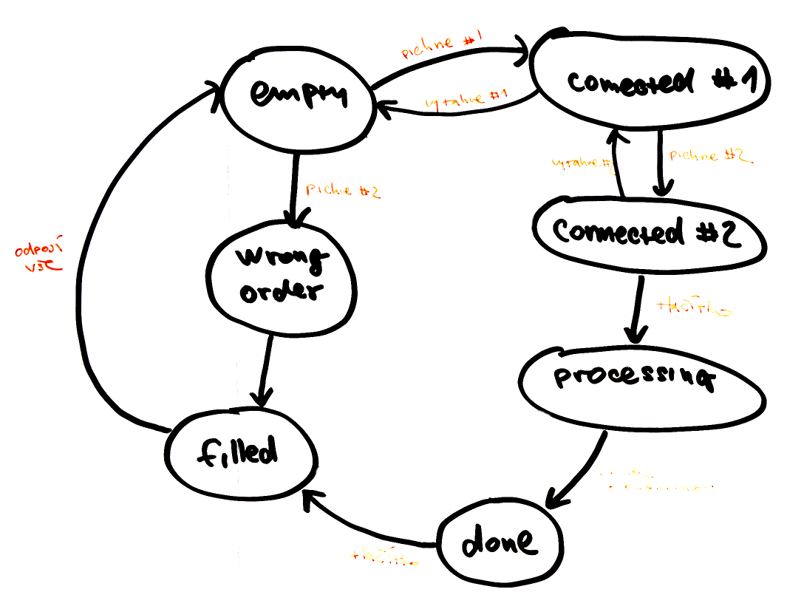
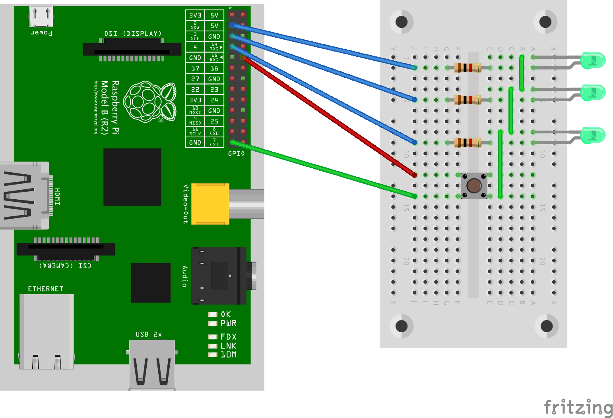

**Jarmilka** je jednoúčelové zařízení sloužící k překopírovávání dat z SD karty
na USB disk či klíčenku. 

**Obsah**

* [Příběh](#p%C5%99%C3%ADb%C4%9Bh)
* [Jak to funguje](#jak-to-funguje)
* [Instalace](#instalace)
* Technické detaily
    * [Zapojení Raspberry Pi](#zapojen%C3%AD-raspberry-pi)
    * [Zapojení USB hubu](#zapojen%C3%AD-usb-hubu)
    * [Zvuky](#zvuky)
    * [Detekce vstupních zařízení](#detekce-vstupn%C3%ADch-za%C5%99%C3%ADzen%C3%AD)
    * [Procesing](#procesing)
* [Děkovačka](#d%C4%9Bkova%C4%8Dka)

# Příběh

Nevím jak u vás, ale mí rodiče poslední roky čím dál zběsileji fotí vnoučata.
Na všechno co je po ruce. Telefon(y), tablet, foťák. Po určité době se ale
dostávají do úzkých, protože nejsou schopni fotky ze zaplněných zařízení dostat
někam ven. Obvykle čekají měsíce než se u nich objevím buďto já nebo ségra, a
fotky jim stáhnem přes počítač na disk či klíčenku.

Protože se blížily vánoce a vybrat dárek pro maminu bývá peklíčko,
pokusil jsem se ji v její fotomisi pomoct. S pomocí staršího Raspberry Pi,
USB hubu, reprobedniček, tlačítka a pár LED diod jsem sestrojil jednoúčelové
zařízení, s pomocí kterého je schopná fotky na disk překopírovávat sama.

# Jak to funguje

Na Raspberry je nainstalován [jednoduchý skript v
Pythonu](application/jarmilka.py), který sleduje stav na USB sběrnici a
instruuje obsluhu k jednotlivým krokům:

* připojení zdrojové SD karty
* připojení cílového disku/USB klíčenky
* zmáčknutí tlačítka pro zahájení kopírování dat
* vytažení obou USB zařízení

Každý krok je pro lepší pochopení doplněn blikající diodou nad místem, kde se
má akce odehrát (např. pokud se má stisknout tlačítko, rozbliká se nad ním
dioda). Navíc, aby to byla větší zábava, ke každému z kroků se z reproduktorů
ozve patřičná výzva namluvená jedním z vnoučat (např. *Připoj jedničku*,
*Kopíruju, dej si kafe*, apod.)

Filesystém Rasbianu je nakonfigurován jako readonly, takže zařízení je odolné
vůči náhodným vypnutím (SD karty je možné velmi lehce poškodit -- pokud by během
zápisu by došlo k vypnutí, nemuselo by zařízení už nikdy nabootovat).

# Instalace

Pro snadnější (a replikovatelnou) konfiguraci RPi jsem napsal Ansible
[playbook](jarmilka.yml).  Pokud budeš chtít Jarmilku rozjet i u sebe,
nainstaluj si na svůj počítač
[Ansible](http://www.ansible.com/how-ansible-works) a pak postupuj takto:

* nainstaluj na SD kartu systém Raspbian (vyzkoušeno s Jessie Lite verze November 2015)
* připoj Raspberry Pi do sítě, nastartuj jej a zjisti jeho IP adresu
* nakopíruj dovnitř RPi svůj veřejný SSH klíč (`~/ssh/authorized_keys`)
* přejmenuj soubor `hosts.example` na `hosts` a změň v něm IP adresu podle tvé situace
* spusť příkaz `ansible-playbook jarmilka.yml`

Po dokončení posledního příkazu se RPi rebootuje a po chvíli se z něj ozve
výzva k prvnímu kroku, tj. vložení zdrojového USB zařízení s SD kartou.

# Technické detaily

## Zapojení Raspberry Pi

* SD karta se systémem a aplikací (instalace výše)
* levné reproduktory (audio výstup)
* externí USB hub (horní USB port na RPi)
* napájení Rpi

Na GPIO porty jsou připojeny LED diody a tlačítko:

* GPIO2 -- LED pro vstupní USB zařízení, viz [LED_1_PIN](application/jarmilka.py#L32)
* GPIO3 -- LED pro výstupní USB zařízení, viz [LED_2_PIN](application/jarmilka.py#L33)
* GPIO4 -- LED pro tlačítko, viz [LED_BUTTON_PIN](application/jarmilka.py#L34)
* GPIO15 -- tlačítko, viz [BUTTON_PIN](application/jarmilka.py#L36)

## Zapojení USB hubu

Raspberry Pi jsem musel dovybavit o externí USB hub, protože přímým připojením
USB zařízení (čtečka SD karet, USB disk) docházelo k restartům Raspberry.
Důvodem je, že externí periferie mohou mít větší odběry, což způsobuje pokles v
napájení Rpi a následně restarty.

Mnou použitý USB hub má celkem 7 portů (a-g), které se mapují uvnitř Rpi následovně:

    Hub, pohled z vrchu (X je napájení):

    X  a  b  c
    +--+--+--+
    |        |
    +--+--+--+
    d  e  f  g

    Řetězce identifikující jednotlivé porty:

    a: /devices/platform/soc/20980000.usb/usb1/1-1/1-1.2/1-1.2.3/1-1.2.3:1.0
    b: /devices/platform/soc/20980000.usb/usb1/1-1/1-1.2/1-1.2.4/1-1.2.4.4/1-1.2.4.4:1.0
    c: /devices/platform/soc/20980000.usb/usb1/1-1/1-1.2/1-1.2.4/1-1.2.4.3/1-1.2.4.3:1.0
    d: /devices/platform/soc/20980000.usb/usb1/1-1/1-1.2/1-1.2.1/1-1.2.1:1.0
    e: /devices/platform/soc/20980000.usb/usb1/1-1/1-1.2/1-1.2.2/1-1.2.2:1.0
    f: /devices/platform/soc/20980000.usb/usb1/1-1/1-1.2/1-1.2.4/1-1.2.4.1/1-1.2.4.1:1.0
    g: /devices/platform/soc/20980000.usb/usb1/1-1/1-1.2/1-1.2.4/1-1.2.4.2/1-1.2.4.2:1.0

V aplikaci se vyskytují dvě konstanty, které identifikují konkrétní port:

* [INPUT_USB](application/jarmilka.py#L29) -- identifikátor vstupního USB zařízení
* [OUTPUT_USB](application/jarmilka.py#L30) -- identifikátor výstupního USB zařízení

Je velmi pravděpodobné, že v tvé situaci budou mít zařízení jiné identifikátory.
(vlastní hodnoty odhalíš pohledem do `/var/log/syslog` uvnitř RPi).

## Zvuky

V adresáři [sounds/](application/sounds/) je sada WAV souborů pro jednotlivé
fáze kopírování.  Soubory jsou pojmenovány podle klíče `stav_cislo.wav`, kde
`stav` odpovídá konkrétnímu stavu aplikace a `cislo` označuje
variantu hlášky (každá z variant je namluvena jedním z vnoučat).

Např. zpráva *Připoj jedničku* existuje ve 3 variantách (`one_01.wav`,
`one_02.wav`, `one_03.wav`). Aplikace Jarmilka si pak náhodně vybírá některou 
z nich.

Pokud budeš do sady zvuků zasahovat, možná budeš muset aktualizovat slovník
[SOUNDS](application/jarmilka.py#L118).

## Detekce vstupních zařízení

Během připojování USB se kontroluje nejen port, kam bylo zařízení připojeno
(chceme aby vstupní čtečka byla v prvním portu a disk v druhém), ale také 
struktura filesystému.

Aktuálně aplikace dokáže rozpoznat 2 typy SD karet.

Android telefon:

    Android
    DCIM
        100ANDRO
        Camera
            ./Camera/IMG_20150619_190421.jpg
            ./Camera/VID_20150619_190427.mp4
    HuaweiBackup
    HwOUC
    HWThemes
    LOST.DIR

Fotoaparát Canon:

    DCIM
        119___06
        120___07
            IMG_0357.JPG
            IMG_0358.JPG
            IMG_0360.JPG
            MVI_0376.MOV
        121___12

## Procesing

Jakmile aplikace detekuje připojení obou zařízení ve správných portech, zahájí
se processing. V aktuální verzi se provede pouze překopírování obsahu s pomocí
aplikace `rsync`. V budoucnu ale možná doplním převzorkování obrázků na 
menší velikosti kvůli rychlejšímu prohlížení na televizi.
    
Samotné kopírování je vcelku pomalé, protože probíhá přes USB hub zapojený
do jediného RPi USB portu. Konkrétní rychlosti závisí také na typu SD karty.
Pro orientaci: 1 GB dat se v mých podmínkách přesunulo za cca 8.5 minuty
(tj. ~2 MB/s).

# Děkovačka

* [Vlastíkovi](https://github.com/slintak) za rady ohledně nastavení readonly filesystému
* Tatovi za vykuchání starého satelitu a zapouzdření chumlu drátů do jeho útrob
